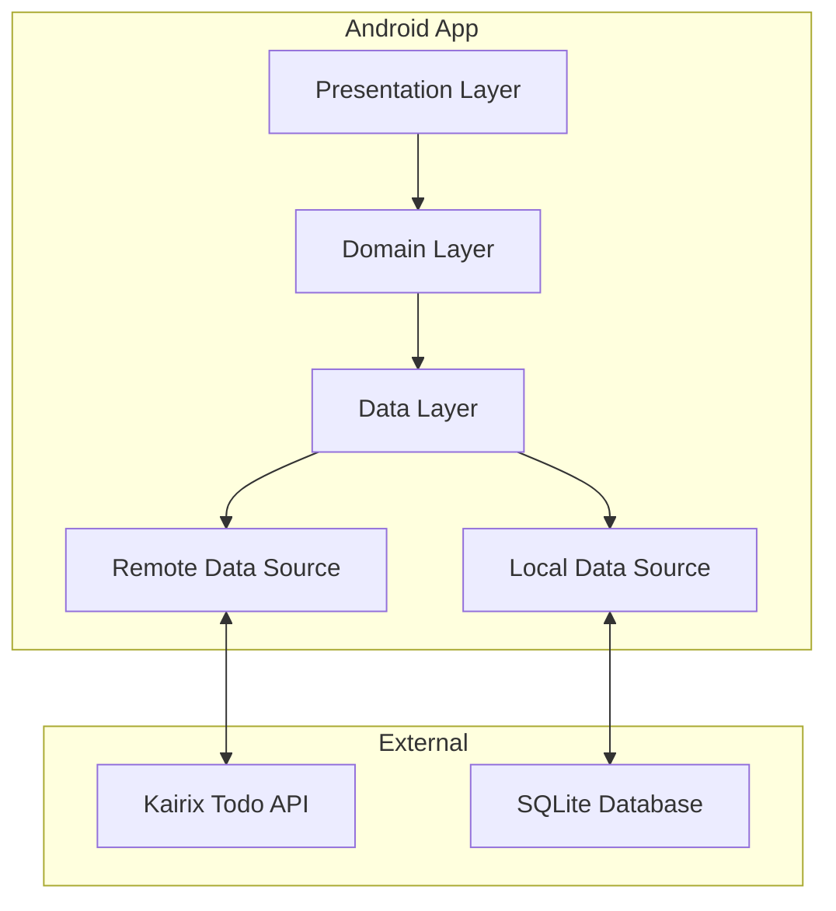
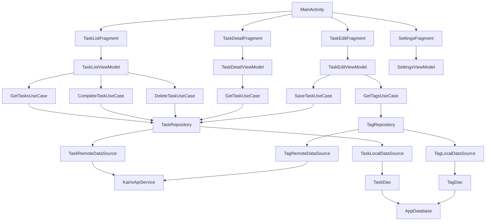
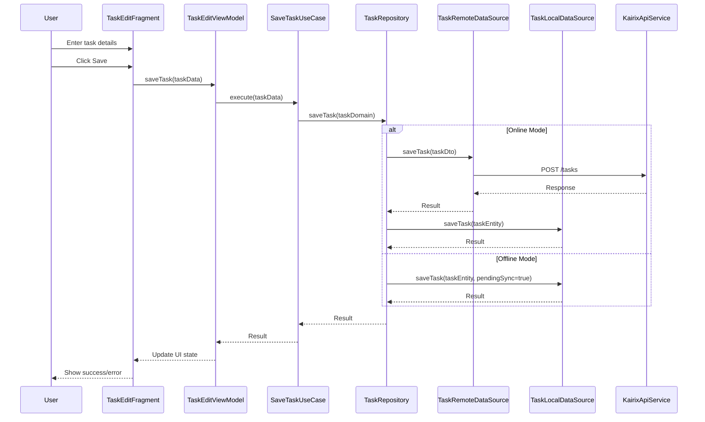
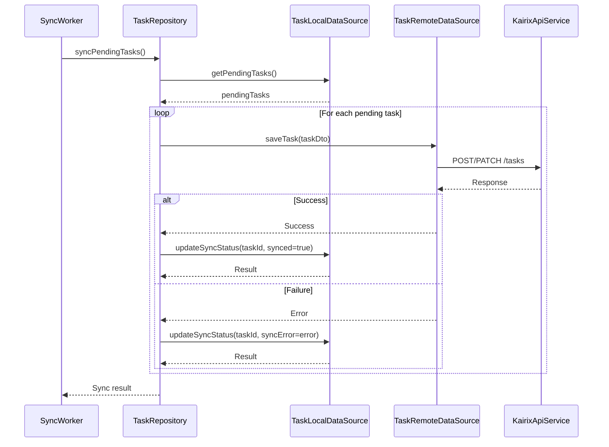
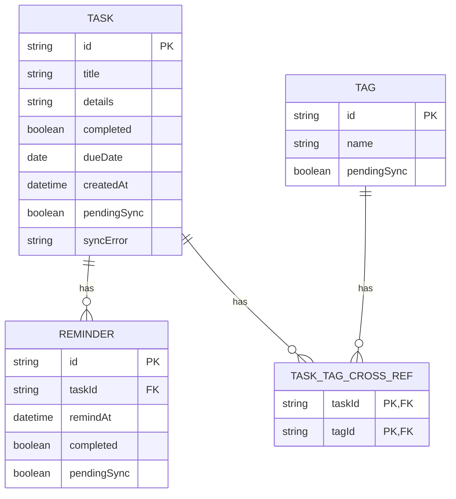
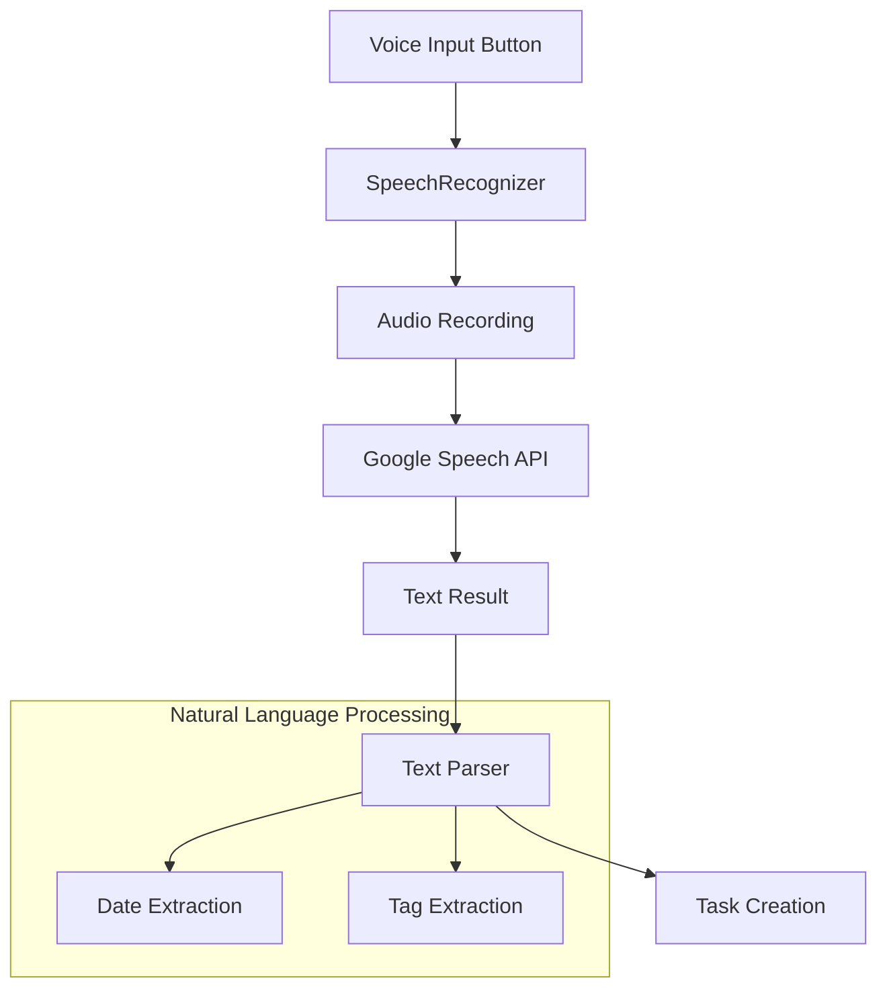
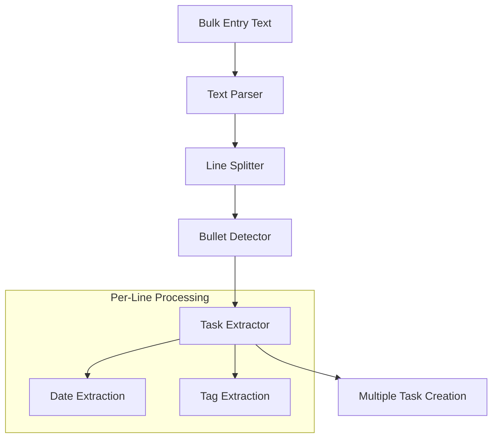

# Kairix Todo Android App - System Design

This document outlines the system architecture and technical design for the Kairix Todo Android application, which will integrate with the existing Kairix Todo web service.

## System Architecture

The application follows the MVVM (Model-View-ViewModel) architecture pattern with a clean architecture approach, separating concerns into distinct layers.

### Layers

1. **Presentation Layer**
   - Activities and Fragments (UI)
   - ViewModels (UI logic)
   - UI State models
   - Adapters and custom views

2. **Domain Layer**
   - Use cases (business logic)
   - Domain models
   - Repository interfaces

3. **Data Layer**
   - Repository implementations
   - Data sources (remote and local)
   - Data mappers
   - API service interfaces

## Component Diagram

## Data Flow

### Task Creation Flow

### Task Synchronization Flow

## Database Schema

## API Integration

The app will integrate with the existing Kairix Todo API as documented in the OpenAPI specification. Key endpoints include:

- `GET /tasks` - List all tasks
- `POST /tasks` - Create a new task
- `GET /tasks/{id}` - Get a specific task
- `PATCH /tasks/{id}` - Update a task
- `DELETE /tasks/{id}` - Delete a task
- `PATCH /tasks/{id}/complete` - Mark a task as completed
- `GET /tags` - List all tags
- `POST /tags` - Create a new tag
- `GET /tasks/search` - Search for tasks with filters

### Authentication

API requests will include the API key in the `X-API-Key` header as required by the backend.

## Offline Support

The app will implement an offline-first approach:

1. **Local Database**: All data will be stored in a local SQLite database using Room.
2. **Synchronization**: A background worker will sync changes when the device is online.
3. **Conflict Resolution**: Last-write-wins strategy with local changes taking precedence.
4. **Pending Changes**: Tasks modified offline will be marked with `pendingSync` flag.

## Key Technical Components

### Android Jetpack Components

- **ViewModel**: Manage UI-related data in a lifecycle-conscious way
- **LiveData/Flow**: Observable data holder classes for UI updates
- **Room**: Database abstraction layer over SQLite
- **WorkManager**: Schedule background tasks for synchronization
- **Navigation Component**: Handle in-app navigation
- **DataStore**: Store user preferences

### Third-Party Libraries

- **Retrofit**: Type-safe HTTP client for API communication
- **Moshi/Gson**: JSON parsing
- **Coroutines/Flow**: Asynchronous programming
- **Dagger Hilt**: Dependency injection
- **Glide/Coil**: Image loading (for user avatars, if implemented)
- **Material Components**: UI components following Material Design
- **Timber**: Logging
- **MockK/JUnit**: Testing

## Voice Input Implementation

The voice input feature will use Android's built-in Speech Recognition API:

1. **Recording**: Use `SpeechRecognizer` to capture audio
2. **Transcription**: Convert speech to text using Android's speech recognition
3. **Parsing**: Custom parser to extract:
   - Task title (main content)
   - Due date (natural language date references)
   - Tags (words with # prefix or context clues)

## Bulk Entry Implementation

The bulk entry feature will parse text input to create multiple tasks:

1. **Text Input**: Multi-line text field for entering tasks
2. **Parsing**: Split by line breaks and detect common bullet formats
3. **Extraction**: For each line, extract:
   - Task title (main content minus bullets)
   - Due date (date references)
   - Tags (# prefixed words)
4. **Preview**: Show parsed tasks before creation
5. **Batch Creation**: Create multiple tasks in a single operation

## Security Considerations

1. **API Key Storage**: Store API key securely using Android Keystore
2. **Data Encryption**: Encrypt sensitive data in the local database
3. **Network Security**: Use HTTPS for all API communications
4. **Input Validation**: Validate all user input before processing

## Performance Considerations

1. **Pagination**: Load tasks in pages to handle large task lists
2. **Efficient Synchronization**: Sync only changed data
3. **Background Processing**: Perform intensive operations off the main thread
4. **Caching**: Cache API responses to reduce network requests
5. **Lazy Loading**: Load data only when needed

## Testing Strategy

1. **Unit Tests**: Test individual components (ViewModels, Use Cases, Repositories)
2. **Integration Tests**: Test interactions between components
3. **UI Tests**: Test user flows with Espresso
4. **Automated User Story Tests**: Map user stories to automated tests

## Deployment Strategy

1. **CI/CD Pipeline**: Automated build and test process
2. **Phased Rollout**: Gradual release to users via Google Play
3. **Feature Flags**: Enable/disable features remotely
4. **Analytics**: Track usage and performance metrics
5. **Crash Reporting**: Monitor and address issues quickly

## Future Considerations

1. **Widget Support**: Home screen widgets for quick task access
2. **Wear OS Integration**: Companion app for smartwatches
3. **Cloud Backup**: Additional backup options beyond API sync
4. **Advanced Filtering**: More sophisticated task filtering options
5. **Collaboration**: Shared task lists (if backend supports it)
